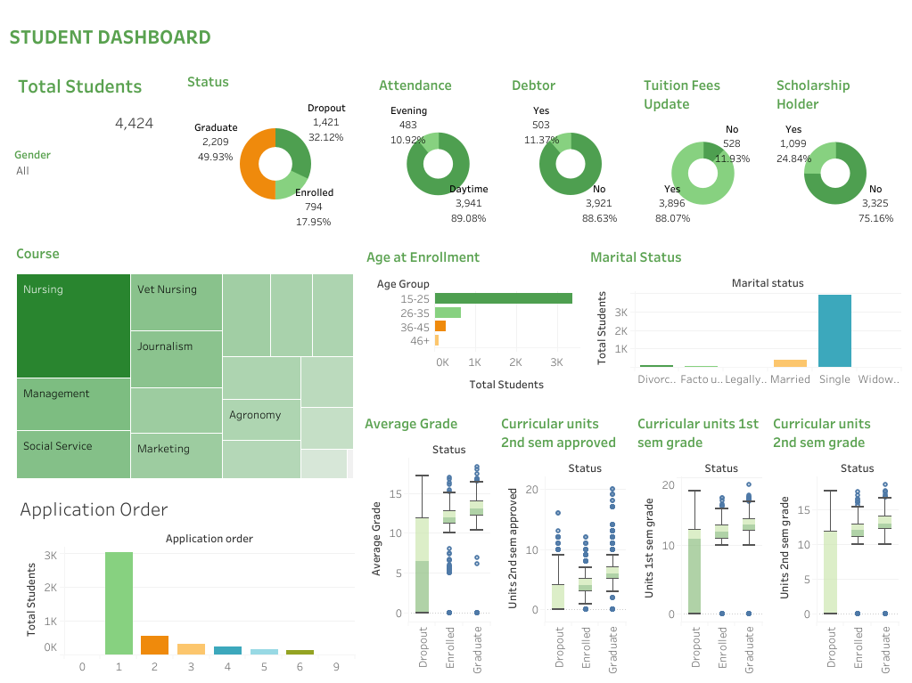

# Proyek Akhir: Menyelesaikan Permasalahan Institusi Pendidikan

## Business Understanding

Jaya Jaya Institut merupakan salah satu institusi pendidikan perguruan yang telah berdiri sejak tahun 2000. Hingga saat ini ia telah mencetak banyak lulusan dengan reputasi yang sangat baik. Namun, tingginya tingkat mahasiswa yang tidak menyelesaikan studinya (dropout) menjadi permasalahan serius yang dapat memengaruhi akreditasi dan reputasi institusi.

Jaya Jaya Institut ingin secara dini mendeteksi mahasiswa yang berisiko tinggi mengalami dropout agar dapat diberikan bimbingan atau intervensi yang sesuai.

Untuk mengatasi tantangan tersebut, institusi ingin mengembangkan sistem berbasis data guna mendeteksi mahasiswa berisiko tinggi melakukan dropout secara dini dan memberikan intervensi yang tepat waktu.

### Permasalahan Bisnis

Berdasarkan pemahaman bisnis yang telah dijelaskan, berikut adalah permasalahan utama yang dihadapi oleh institut:

- Tingginya tingkat dropout yang berdampak pada akreditasi dan reputasi institusi pendidikan.
- Tidak adanya sistem pemantauan atau early warning system berbasis data yang dapat mendeteksi risiko dropout secara proaktif.
- Tidak adanya strategi retensi mahasiswa yang terukur dan berbasis analisis.
- Kurang optimalnya alokasi sumber daya pengajaran serta potensi kerugian finansial bagi institusi maupun mahasiswa.

### Cakupan Proyek

Proyek ini bertujuan menjawab tantangan tingginya dropout dengan memanfaatkan data historis akademik mahasiswa untuk mengidentifikasi faktor-faktor kunci yang memengaruhi keputusan keluar dari studi.

Proyek ini menggunakan data historis akademik dan latar belakang mahasiswa, termasuk aspek demografis dan sosial ekonomi, untuk:

- Melakukan eksplorasi data (EDA) untuk menemukan distribusi dan pola-pola yang mencurigakan.
- Menganalisis keterkaitan antara faktor seperti pendidikan orang tua, biaya kuliah, nilai semester, dan status akademik terhadap risiko dropout.
- Membangun model klasifikasi berbasis machine learning untuk prediksi dropout secara individual.
- Mengembangkan dashboard interaktif sebagai alat bantu monitoring dan pengambilan keputusan oleh staf akademik.
- Menyusun rekomendasi kebijakan berbasis data untuk meningkatkan retensi mahasiswa.

### Persiapan

Sumber data: [Student Data](https://github.com/dicodingacademy/dicoding_dataset/tree/main/students_performance)

**Setup Environment**

Untuk menjalankan analisis dan aplikasi prediksi, lingkungan Python perlu disiapkan dengan langkah berikut:

**1. Clone this repository to your local computer**

```
git@github.com:nafakhairunnisa/bpds_proyek-pertama.git
```

**2. Setup Environment**
**Pilihan 1: Menggunakan Anaconda**

```
conda create --name main-ds python=3.12.9
conda activate main-ds
pip install -r requirements.txt
pip install streamlit
```

**Pilihan 2: Menggunakan pipenv (Virtual Environment di Shell/Terminal)**

```
mkdir bpds_proyek-pertama
cd bpds_proyek-pertama
pipenv install --python 3.12.9
pipenv shell
pip install -r requirements.txt
pip install streamlit
```

## Business Dashboard

Business dashboard adalah alat visualisasi yang menyajikan data analitik secara interaktif untuk mendukung pengambilan keputusan. Pada studi kasus ini, dashboard digunakan untuk mengetahui alasan tingginya dropout berdasarkan fitur-fitur yang memiliki keterkaitan signifikan dengan status mahasiswa. Dengan demikian, pihak institut dapat mengidentifikasi penyebab utama mahasiswa dropout dan mengambil keputusan berbasis data.

Berikut komponen yang tercantum dalam dashboard ditunjukkan pada tabel 1.

Tabel 1. Komponen pada Business Dashboard Student
| **Komponen**                       | **Visualisasi**        | **Jenis Data**        | **Tujuan**                                                                     |
| ---------------------------------- | ---------------------- | --------------------- | ------------------------------------------------------------------------------ |
| **Total Students (KPI Summary)**   | Angka Total (4,424)    | Ringkasan             | Memberikan ringkasan jumlah seluruh mahasiswa dalam dataset                    |
| **Status**                         | Donut Chart            | Kategorikal           | Menunjukkan proporsi mahasiswa yang lulus, dropout, dan masih aktif            |
| **Gender**                         | Teks / Filter Dropdown | Kategorikal           | (Opsional) Untuk melihat data berdasarkan jenis kelamin                        |
| **Attendance (Waktu Kuliah)**      | Donut Chart            | Kategorikal           | Menunjukkan distribusi mahasiswa berdasarkan waktu kuliah (Daytime vs Evening) |
| **Debtor**                         | Donut Chart            | Kategorikal           | Menampilkan status mahasiswa yang memiliki utang                               |
| **Tuition Fees Update**            | Donut Chart            | Kategorikal           | Menunjukkan apakah UKT mahasiswa telah diperbarui                              |
| **Scholarship Holder**             | Donut Chart            | Kategorikal           | Menunjukkan proporsi mahasiswa penerima beasiswa                               |
| **Course**                         | Treemap                | Kategorikal           | Visualisasi persebaran mahasiswa per program studi                             |
| **Age at Enrollment**              | Horizontal Bar Chart   | Kategorikal Numerikal | Menampilkan distribusi usia mahasiswa saat masuk kuliah                        |
| **Marital Status**                 | Bar Chart Vertikal     | Kategorikal           | Menunjukkan status pernikahan mahasiswa dan hubungannya dengan dropout         |
| **Average Grade**                  | Boxplot                | Numerikal             | Memperlihatkan distribusi IPK berdasarkan status mahasiswa                     |
| **Curricular Units 1st Sem Grade** | Boxplot                | Numerikal             | Melihat distribusi nilai semester 1 dan hubungannya dengan status mahasiswa    |
| **Curricular Units 2nd Sem Grade** | Boxplot                | Numerikal             | Melihat distribusi nilai semester 2 dan hubungannya dengan status mahasiswa    |
| **Application Order**              | Bar Chart Vertikal     | Kategorikal           | Menunjukkan urutan pilihan jurusan dan keterkaitannya dengan tingkat dropout   |

Tools yang digunakan untuk membuat dashboard adalah Tableau Public versi 2024.1. Dashboard ini dibuat interaktif agar siapapun dapat mengeksplorasi dan memperoleh insight secara mandiri dari data yang tersedia.

**Preview Dashboard**

Gambar 1. Cuplikan Dashboard

Tautan dashboard dapat diakses [di sini](https://public.tableau.com/shared/4QBMDBW99?:display_count=n&:origin=viz_share_link).

## Menjalankan Sistem Machine Learning

Model machine learning yang telah dibuat dideploy ke dalam sebuah aplikasi streamlit. Model yang digunakan yaitu Random Forest yang merupakan model terbaik dengan akurasi 74% dan Random Forest unggul dalam menghasilkan nilai f1-score yang stabil.

Adapun fitur-fitur relevan yang digunakan ditunjukkan pada tabel 2.

Tabel 2. Fitur-fitur relevan
| No. | Feature Name                          | Type        | Description                                                                 |
|-----|---------------------------------------|-------------|-----------------------------------------------------------------------------|
| 1   | Marital_status                        | Categorical | Status pernikahan mahasiswa (Single, Married, Divorced, dll)               |
| 2   | Application_mode                      | Categorical | Jalur masuk atau metode pendaftaran mahasiswa                              |
| 3   | Course                                | Categorical | Program studi yang diambil mahasiswa                                       |
| 4   | Daytime_evening_attendance            | Categorical | Jenis kelas: Siang atau Malam                                              |
| 5   | Debtor                                | Categorical | Status apakah mahasiswa memiliki utang (Yes/No)                            |
| 6   | Tuition_fees_up_to_date               | Categorical | Status pembayaran SPP apakah sudah diperbarui atau belum                   |
| 7   | Gender                                | Categorical | Jenis kelamin mahasiswa                                                    |
| 8   | Scholarship_holder                    | Categorical | Status apakah mahasiswa menerima beasiswa (Yes/No)                         |
| 9   | Application_order                     | Numerical   | Urutan pilihan jurusan saat mendaftar                                      |
| 10  | avg_grade                             | Numerical   | Rata-rata nilai akademik mahasiswa                                         |
| 11  | Age_at_enrollment                     | Numerical   | Usia mahasiswa saat pertama kali mendaftar                                 |
| 12  | Curricular_units_1st_sem_approved     | Numerical   | Jumlah mata kuliah semester 1 yang disetujui/lulus                         |
| 13  | Curricular_units_2nd_sem_approved     | Numerical   | Jumlah mata kuliah semester 2 yang disetujui/lulus                         |
| 14  | Curricular_units_1st_sem_grade        | Numerical   | Nilai rata-rata mata kuliah semester 1                                     |
| 15  | Curricular_units_2nd_sem_grade        | Numerical   | Nilai rata-rata mata kuliah semester 2                                     |
| 16  | **Status**                            | **Label**   | Target label: Lulus / Dropout / Aktif                                      |


Berikut cara menjalankan sistem machine learning:

**1. Buka direktori file app.py berada melalui anaconda**

```
cd ...\bpds_proyek-akhir
```

**2. Run streamlit app**

```
streamlit run app.py
```

Anda juga dapat mengakses aplikasi streamlitnya melalui link berikut: [Link Streamlit](https://status-mahasiswa-predict.streamlit.app/).

## Conclusion

Pada proyek ini saya telah membuat:
1.	Model machine learning dapat digunakan untuk memprediksi risiko dropout mahasiswa secara lebih dini.
2.	Dashboard membantu pihak universitas dalam memahami faktor-faktor utama yang memengaruhi dropout, baik dari sisi akademik, sosial, maupun finansial.

Berdasarkan hasil analisis data, visualisasi dashboard, serta implementasi model machine learning, proyek ini berhasil mengidentifikasi faktor-faktor utama yang memengaruhi banyaknya mahasiswa yang dropout.

### Insights dan Rekomendasi Pengurangan Dropout Mahasiswa

#### 1. Karakteristik Dataset dan Demografi
- Dataset mencakup **4.424 mahasiswa**.
- Mayoritas berusia **15–25 tahun**, belum menikah, dan mengikuti **kelas siang (89.08%)**.
- Hanya **24.84% mahasiswa menerima beasiswa**, sementara **11.37% merupakan debitur**.
- **11.93% belum memperbarui informasi pembayaran SPP**.

#### 2. Status Mahasiswa dan Distribusi Course
- Status akhir mahasiswa:
  - **Lulus**: 49.93%
  - **Dropout**: 32.12%
  - **Aktif (enrolled)**: 17.95%
- Program studi dengan jumlah mahasiswa terbanyak:
  - **Nursing**, **Vet Nursing**
  - Diikuti oleh **Journalism**, **Social Service**, dan **Management**
- Jurusan **Management** menunjukkan tingkat dropout tinggi → perlu evaluasi.

#### 3. Waktu Kuliah dan Status Pernikahan
- **Kelas malam** memiliki tingkat kelulusan lebih tinggi dan dropout lebih rendah dibanding kelas siang.
- Mahasiswa **belum menikah** memiliki peluang kelulusan lebih tinggi.
- Status menikah/divorced/janda belum menunjukkan pola signifikan karena jumlah kecil.

#### 4. Kinerja Akademik dan Pola Dropout
- Mahasiswa dropout cenderung memiliki:
  - Nilai **semester 1 dan 2 lebih rendah**
  - **Rata-rata nilai akhir** yang rendah
  - **Jumlah mata kuliah yang dikreditkan** lebih sedikit
- Mahasiswa yang lulus menunjukkan **kinerja akademik stabil sejak awal**.
- **Usia saat masuk kuliah tidak berpengaruh signifikan**.

#### 5. Faktor Signifikan terhadap Dropout

a. Faktor Demografis dan Administratif:
- **Kelas malam** → dropout lebih rendah
- **Penerima beasiswa** → performa lebih baik
- **Mahasiswa tanpa utang & update SPP** → peluang lulus lebih tinggi

b. Faktor Akademik:
- Nilai semester 1 dan 2
- Rata-rata nilai keseluruhan
- Jumlah mata kuliah di semester awal

c. Faktor Program Studi:
- **Nursing & Vet Nursing** → dominan dalam kontribusi lulusan
- **Management** → perlu perhatian karena angka dropout tinggi

### Rekomendasi Action Items

#### 1. Bimbingan Akademik Intensif
- Monitoring akademik sejak semester 1–2
- Bimbingan belajar untuk mata kuliah dengan kelulusan rendah
- Mentoring mahasiswa baru oleh senior berprestasi

#### 2. Penyesuaian Sistem Pembelajaran
- Optimasi jadwal kuliah siang
- Pembelajaran hybrid (online & offline)
- Penyediaan rekaman kuliah untuk fleksibilitas belajar

#### 3. Dukungan Finansial dan Beasiswa
- Perluasan beasiswa untuk mahasiswa ekonomi rendah yang berprestasi
- Program kerja paruh waktu di kampus
- Skema cicilan pembayaran SPP yang fleksibel

#### 4. Perbaikan Manajemen Program Studi
- Evaluasi kurikulum pada program studi dengan dropout tinggi (contoh: Management)
- Pengembangan kompetensi dosen
- Orientasi komprehensif untuk mahasiswa baru di program studi rentan
